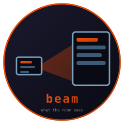

# beam

  [](https://github.com/isene/fe2o3)

Remote control for the presentation workspace.



With a workspace pinned to an external monitor, its active tab is what
the room sees. beam lists the windows parked there and shows the one
you pick, while the workspace you are typing on never changes and the
keyboard stays where it was.

<br clear="left"/>

## Usage

```sh
beam                # the TUI, workspace 10
beam --ws 7         # another workspace
beam --list         # windows on the workspace, tab-separated
beam --show 12345   # show that window, no TUI
```

In the TUI: `↑↓` select, `Enter` show it, `r` refresh, `q` quit.
The green dot marks the window currently visible.

## How it works

beam sends the EWMH `_NET_ACTIVE_WINDOW` ClientMessage. The
[tile](https://github.com/isene/tile) WM raises that window's tab on
its own workspace: on screen it swaps in place, off screen it is
recorded for the next visit. A cross-workspace raise restores the
keyboard focus, so driving the external cannot steal your typing.

Fully event-driven: beam blocks on your keys and asks X only when it
redraws. No tick, no polling.

## Install

```sh
git clone https://github.com/isene/beam
cd beam
cargo build --release
ln -s "$PWD/target/release/beam" ~/bin/beam
```

Needs a WM that acts on `_NET_ACTIVE_WINDOW` for unmapped windows;
tile does as of 2026-08-23.

## License

Public domain (Unlicense). Do what you want with it.
